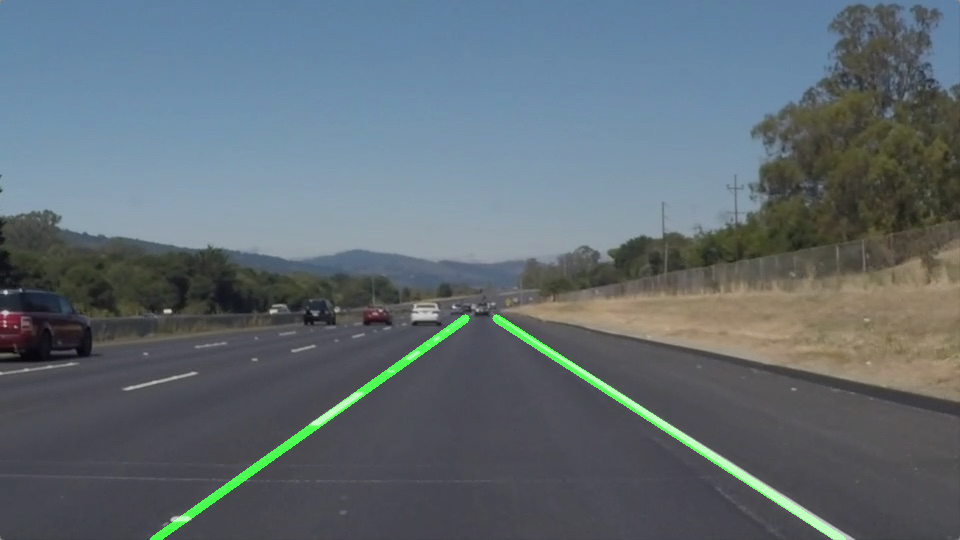

# **Finding Lane Lines on the Road** 

The goals / steps of this project are the following:
* Make a pipeline that finds lane lines on the road
* Reflect on your work in a written report

### Reflection

### 1. My pipeline implementation comprises of the following steps.

To keep my description simple, I applied all the given helper functions to the input image respectively.
* Firstly, I converted the images to a grayscale image.
* Applied the gaussian filter on the transformed grayscale image to remove noise and blur the input image.
* Transformed the filtered image to find the edges in the image.
* Now, a four-sided polygon area containing lanes is masked with the canny image. This outputs a masked image consisting of an image area the within polygon and coloring out the external polygon area into black.
* After this process, the hough transformation is applied to retain the lane lines from the canny output image.
* While applying the above transformation, a user-defined function is employed to draw the lines along the lane.
* Lastly, a weighted funciton is applied to incorporate the blank image with drawn lines over lanes in the input image.

#### In order to draw a single line on the left and right lanes, I modified the draw_lines() function in following way,
* First of all, the left and right lanes were separately identified by comparing the slope, from the given coordinate points, to the tan value.
* A least square polynomial fit is applied to the respective left and right lane values. And the resulting vector coefficients were used to normalize the end-points of the lines to be drawn.
* Then, the identfied line segments were extrapolated to draw the lines along the lanes respectively.

### 2. Potential shortcomings with the current pipeline

As it can be noticed in the optional challenge of the lane detection project,
One potential shortcoming would be what would happen when the current pipeline process is applied on the curling/bent roads, i.e lanes. and our lines are drawn straight unlike the path generated from the curvy lanes.

Another shortcoming could be a problem when the car is in the middle of switching lanes, and how would the car perceive the lane lines since the car heading angle may not be aligned with the lane line.

### 3. Possible improvements to the current pipeline

A possible improvement would be to use a deep learning algorithm to train a model, on the test images with different cases, that can detect lanes along the curvy roads as well.
As the current line extrapolation mapping on the lanes is pretty linear, focusing on implementing an extrapolation method that is non-linear and dynamic among evey lane segment would be beneficial.
